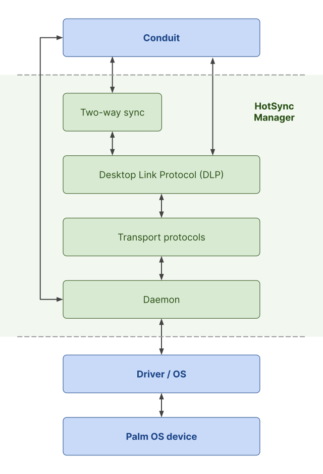
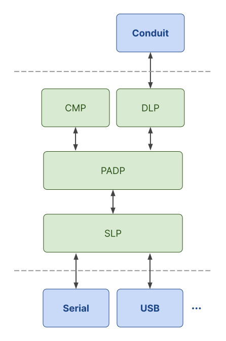
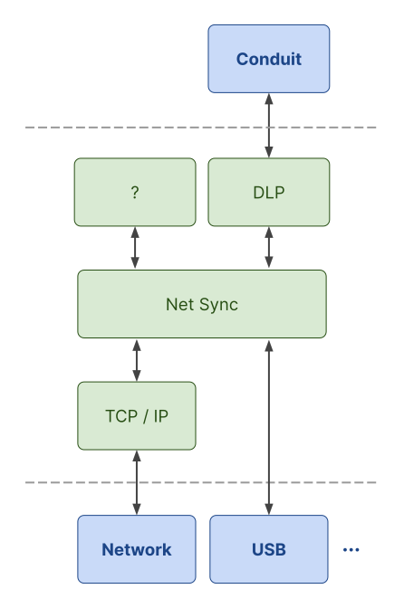

# How Palm OS HotSync Works

HotSync is a system of communication protocols that enables Palm OS devices to synchronize data with desktop computers. It often served as a Palm device's primary way of communicating with the outside world, for all kinds of use cases including transferring data, installing third-party apps, and sending and receiving emails. HotSync was a core part of the Palm OS user experience, and was quite an amazing piece technology for its time.

This document explains at a high level how it all works under the hood.

Beware that the information in this document may not be fully accurate. HotSync was a proprietary system and Palm never published technical specs for many of its components. Much of the information below is based on the incredible reverse engineering work done by two open source projects, [pilot-link](https://github.com/jichu4n/pilot-link) and [ColdSync](https://github.com/dwery/coldsync), in the early 2000s. It also incorporates some of my own research while developing [palm-sync](https://github.com/jichu4n/palm-sync), a modern implementation of HotSync in TypeScript. If you spot any errors, please feel free to let me know via an issue / PR!

## Overview

Here's a high level diagram illustrating the main components of HotSync:

Overview of the main components:

- **Conduit**: Sync logic that runs on the computer. The official [Palm Desktop](https://palmdb.net/app/palm-desktop) software includes a number of built-in conduits, and can be extended with additional third-party conduits.

- **Desktop Link Protocol (DLP)**: Application level protocol for communicating with a Palm device. The protocol operates in a familiar request-response API style, where a conduit can send a request to the Palm and get back a response. A modern analogy might be a gRPC or REST API.

- **Two-way sync**: Standard logic for synchronizing records that may be manipulated on the Palm device, on the computer, or both. Most Palm apps and their corresponding conduits follow the standard spec for marking records as new / dirty / deleted, and can thus rely on the two-way sync logic without reinventing the wheel. A modern analogy might be something like [OT](https://en.wikipedia.org/wiki/Operational_transformation).

- **Transport protocols**: Depending on the physical connection and the particular device, one of two transport protocol stacks is used to transport DLP requests and responses between the computer and the Palm device. A modern analogy might be the HTTP / TCP / IP stack.

- **Sync server**: For lack of a better term, this is the component that directly interacts with the computer's operating system and device drivers. It's responsible for things like setting up serial / USB / network connections and actually sending and receiving data through these connections.

Now let's dive into the components that make up the HotSync protocol stack.

## Desktop Link Protocol (DLP)

DLP is the application level protocol in HotSync's protocol stack. It provides a request-response style API that serves as a clean abstraction over different physical connections such as serial, USB, IrDA, modem, Bluetooth, and Wi-Fi.

Each DLP request performs a specific action such as getting / setting the system time, opending / closing a database, and reading / writing a record. The initial version of Palm OS supported about 30 different requests, and each subsequent major version of Palm OS added more requests, culminating in Palm OS 5 which supported a total of ~80 requests. DLP requests and responses are relatively well documented as they were made available to third-party conduit developers.

Note that unlike many modern web APIs, DLP is a stateful API, and requests must be made sequentially. For example, the conduit might send a 1st request to open a database, a 2nd request to read its records, then a 3rd request to close it.

Resources:

- [DLCommon.h](https://github.com/jichu4n/palm-os-sdk/blob/master/sdk-5r3/include/Core/System/DLCommon.h) in the Palm OS SDK, which contains the definitions for all DLP request and response types
- [dlp.h](https://github.com/dwery/coldsync/blob/master/include/pconn/dlp.h) in ColdSync

## Two-way sync

The [Palm Desktop](https://palmdb.net/app/palm-desktop) software allows a user to edit data both on their computer and on their Palm device, then use HotSync to synchronize the two. For example, a user can create a new TODO item on their computer, and separately edit an existing TODO item on the Palm. After a successful HotSync, both devices are guaranteed to end up with the same updated TODO list. This required a way to mark changes and reconcile conflicts, conceptually similar to how modern online collaborative tools like Google Docs must reconcile edits from multiple users.

To solve this problem, Palm developed a generic two-way sync system with first class support in DLP and Palm OS APIs. This system is used by the built-in applications and conduits, and can be used by third-party apps / conduits as long as both sides (app and conduit) follow the standard spec. That said, this is purely optional and third-party developers are free to implement their own custom synchronization logic directly on top of DLP.

Palm OS's two-way sync system might seem primitive today compared to algorithms like OT and CRDTs, but at the time it solved the data synchronization problem well enough that it was seen as a "killer" feature of the Palm platform.

Resources:

- Palm OS Programming: The Developer's Guide, Ch. 16, p. 529 - [Google Books](https://www.google.com/books/edition/Palm_OS_Programming/PkHi3Ctrn3sC?hl=en&gbpv=1&pg=PA529&printsec=frontcover), [Internet Archive](https://archive.org/details/palmosprogrammin0000rhod/page/528/mode/2up)
- Palm OS Programming Bible 2nd ed, Chapter 21, p. 739

## Transport protocols

Sitting below DLP are two alternative transport protocol stacks. Which stack is used for a HotSync session depends on the type of physical connection (e.g. serial, USB, Wi-Fi) as well as the specific device model. We'll call the two protocol stacks **Serial Sync** and **Net Sync** based on their original application, but it's important to note that both of these can be used over various types of physical connections, as discussed in more detail below.

### Serial Sync

The Serial Sync protocol stack is illustrated in the following diagram:

#### Serial Link Protocol (SLP)

SLP is a low level data transmission protocol that provides the basic abstraction of data packets on top of a bidirectional byte stream. Delivery is best effort but each packet includes a checksum to ensure integrity. Its role in the protocol stack is conceptually similar to that of IP in the networking stack.

In addition to HotSync, SLP was also available to third-party developers for general use.

Resources:

- [Palm OS Programmer's Companion, vol. II](./Palm%20OS%20Programmer's%20Companion,%20vol%20II.pdf), Ch. 5, p. 120.
- [slp.h](https://github.com/dwery/coldsync/blob/master/include/pconn/slp.h) in ColdSync

#### Packet Assembly / Disassembly Protocol (PADP)

PADP provides reliable, ordered delivery on top of SLP. Its role in the
protocol stack is conceptually similar to that of TCP in the networking stack.

Each PADP data packet is broken down and transmitted as one or more smaller SLP data packets. The receiver can reassemble the original PADP data packet based on the ordering information in each SLP data packet.

The receiver must confirm receipt of each SLP data packet with an ACK. If the sender doesn't receive an ACK within a timeout window (2s), it will attempt to retransmit the SLP data packet up to a maximum of 10 times. The receiver is able to discard duplicate SLP data packets when reassembling the original PADP data packet.

PADP was only used internally by HotSync itself and was not available to third-party developers.

Resources:

- [PadCommn.h](https://github.com/jichu4n/palm-os-sdk/blob/master/sdk-2/include/Core/System/PadCommn.h) in early versions of the Palm OS SDK
- [padp.h](https://github.com/dwery/coldsync/blob/master/include/pconn/padp.h) in ColdSync

#### Connection Management Protocol (CMP)

CMP is used at the very beginning of each HotSync session to negotiate the baud rate for subsequent DLP traffic.

When communicating through a physical serial port, the computer and Palm OS device will use an initial baud rate of 9600. As part of the CMP handshake, the device provides its maximum supported baud rate to the computer, which then responds with the actual baud rate to use for subsequent communication. The device will switch over to that baud rate and start accepting DLP requests.

However, the Serial Sync protocol stack is also used in situations where there is no physical baud rate involved. For example, certain early Handspring Visor models directly connect to a computer via a USB cable but still use the Serial Sync protocol stack for HotSync. In such cases, the CMP handshake still takes place but is basically a no-op.

Resources:

- [CMCommon.h](https://github.com/jichu4n/palm-os-sdk/blob/master/sdk-5r3/include/Core/System/CMCommon.h) in the Palm OS SDK
- [cmp.h](https://github.com/dwery/coldsync/blob/master/include/pconn/cmp.h) in ColdSync

#### Hardware

The Serial Sync protocol stack is used in the following scenarios:

- Cradle / cable connection:
  - Many early Palm devices that shipped with a serial cradle / cable, such as the 1st and 2nd generation Palm Pilots, Palm III series, Palm V series, Palm VII series, Palm m100 and m105.
  - Early Handspring Visor and Treo devices that shipped with a USB cradle / cable, such as the original Visor and Treo 300
  - Early Sony CLIE devices that shipped with a USB cradle / cable, such as the S300
- IrDA connection
  - All Palm OS devices when performing HotSync over IR
- Network connection:
  - Palm OS Emulator (POSE) and modern derivatives that emulate a serial connection over a TCP/IP connection

### Net Sync

The Net Sync protocol stack is illustrated in the following diagram:

The most important difference of Net Sync compared to the Serial Sync protocol
stack is that Net Sync assumes an underlying connection that already provides
reliable and error-checked delivery. As a result, it does not need to include
lower level protocols like SLP and PADP that implement these features.

#### Handshake protocol

There is a handshake protocol used at the beginning of each Net Sync-based
HotSync session, analogous to CMP in the Serial Sync protocol stack. However,
not much is currently known about it. Open source implementations (pilot-link
and ColdSync) simply play back a hard-coded byte sequence captured during real
HotSync sessions, which appears to work fine in practice.

Resources:

- [netsync.c](https://github.com/dwery/coldsync/blob/master/libpconn/netsync.c)
  in ColdSync

#### Net Sync

The Net Sync protocol is a fairly lightweight protocol that mainly serves to
provide ordered delivery, similar to a much simplified version of PADP.

Resources:

- [netsync.h](https://github.com/dwery/coldsync/blob/master/include/pconn/netsync.h)
  in ColdSync

#### Hardware

The Net Sync protocol stack is used in the following scenarios:

- Cradle / cable connection:
  - Most Palm OS devices that shipped with a USB cradle / cable, including the Palm m500 series, Tungsten series, Zire series, later Handspring and Sony CLIE models
- Network connection:
  - All Palm OS devices when performing Network HotSync over modem or Wi-Fi

