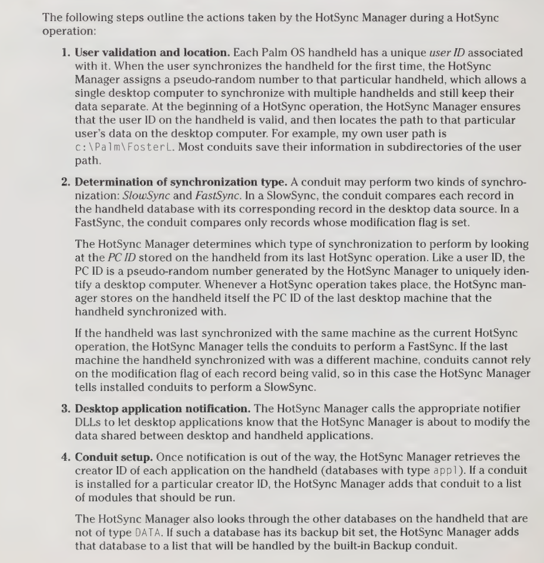
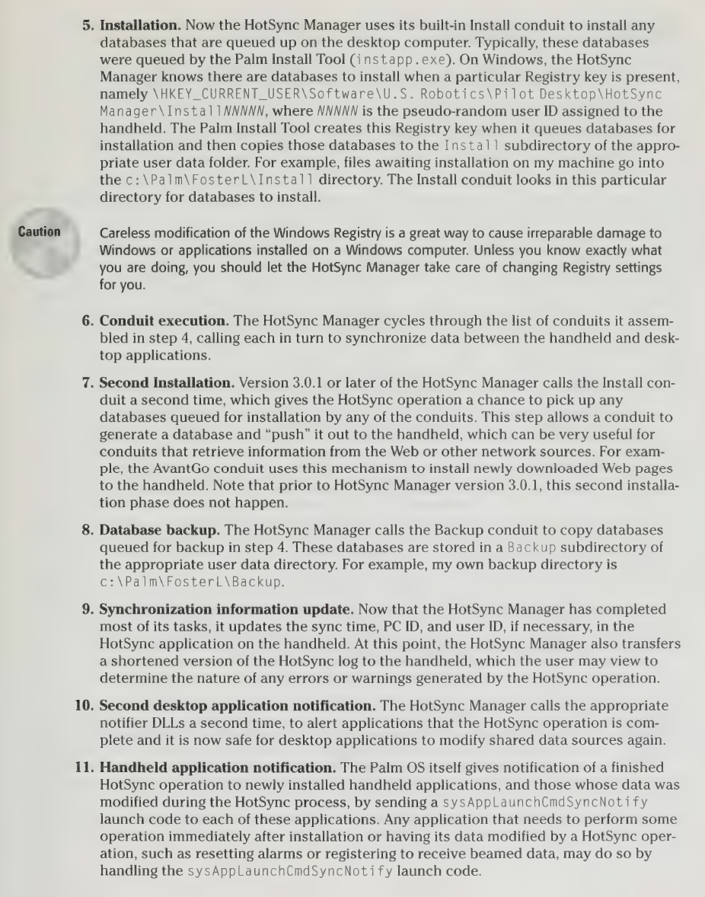
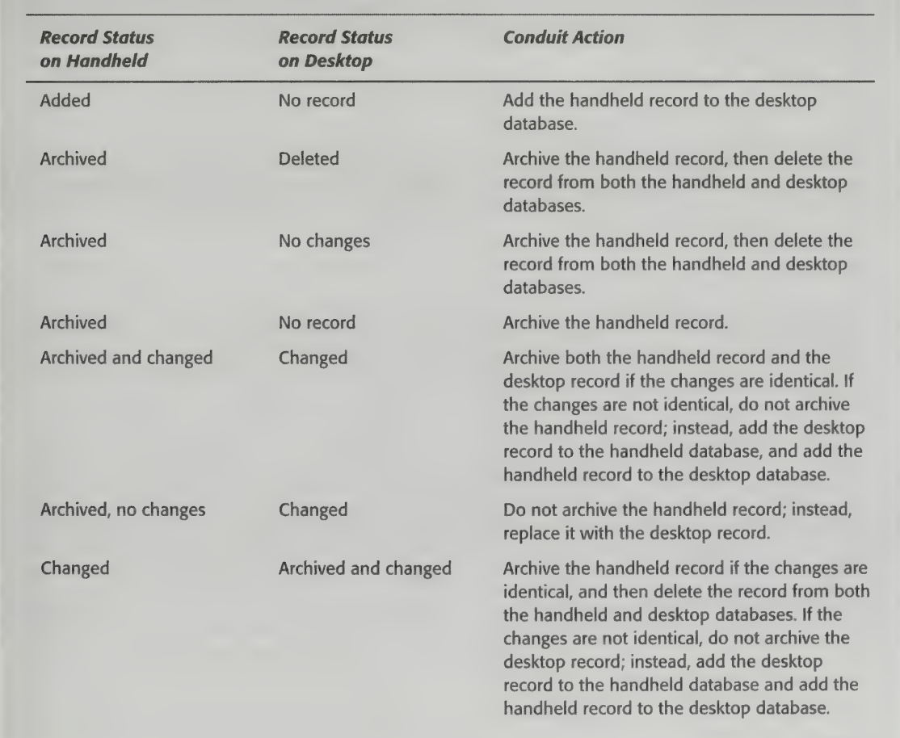
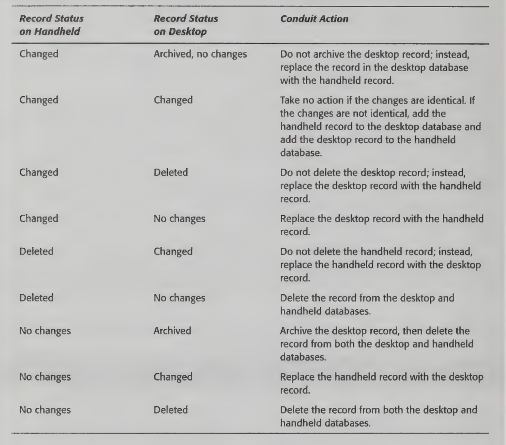
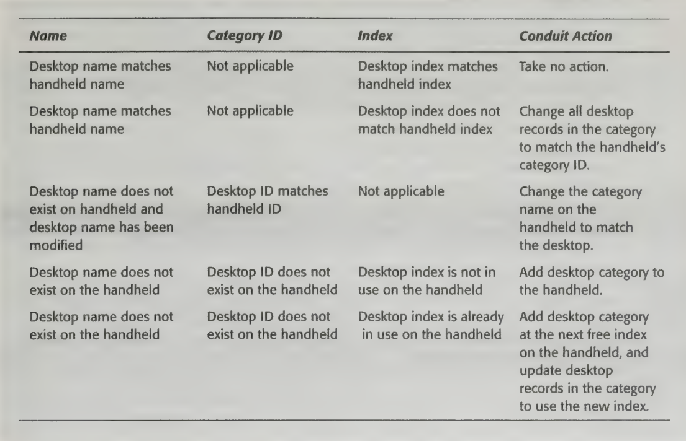

# How Palm OS HotSync Works

HotSync enables Palm OS devices to synchronize data with desktop computers, often serving as their primary means of communicating with the outside world. Launching alongside the very first Pilot models in 1996, HotSync was a core part of the Palm OS user experience and a groundbreaking technology for its time.

This document explores how the it works under the hood.

Beware that the information here may not be fully accurate. HotSync was a proprietary system and Palm never published technical specs for many of its components. Much of the information below is based on the incredible reverse engineering work done by two open source projects, [pilot-link](https://github.com/jichu4n/pilot-link) and [ColdSync](https://github.com/dwery/coldsync), in the early 2000s. It also incorporates some of my own research while developing [palm-sync](https://github.com/jichu4n/palm-sync), a modern implementation of HotSync in TypeScript. If you spot any errors, please feel free to let me know via an issue / PR!

## Overview

Breaking down the main components involved in the HotSync process, the overall architecture looks something like this:

The main components are:

- **Conduit**: Modules containing HotSync logic that runs on the computer. The [Palm Desktop](https://palmdb.net/app/palm-desktop) software includes a number of built-in conduits, and can be extended with additional third-party conduits.

- **Desktop Link Protocol (DLP)**: Application level protocol for communicating with a Palm device. The protocol operates in a familiar request-response API style, where a conduit can send a request to the Palm and get back a response. A modern analogy might be a gRPC or REST API.

- **Two-way sync**: A generic system for synchronizing data that may be manipulated on the Palm device, on the computer, or both. Most Palm applications rely on the generic two-way sync logic without reinventing the wheel. A modern analogy might be something like [OT](https://en.wikipedia.org/wiki/Operational_transformation).

- **Transport protocols**: Depending on the physical connection and the particular device, one of two transport protocol stacks is used to transport DLP requests and responses between the computer and the Palm device. A modern analogy might be the HTTP / TCP / IP stack.

- **Daemon**: For lack of a better term, this is the component that directly interacts with the computer's operating system and device drivers. It's responsible for things like setting up serial / USB / network connections and actually sending and receiving data through these connections.

When the user connects their Palm OS device to a computer and initiates a HotSync, the [Palm Desktop](https://palmdb.net/app/palm-desktop) software will run built-in conduits such as installing third-party apps, synchronizing the state of built-in applications, and backing up the device. In addition, it will run any third-party conduits installed by the user.

The process is detailed in the _Palm OS Programming Bible (2nd ed)_, Ch. 20:

  
   
  

## Desktop Link Protocol (DLP)

DLP is the application level protocol in HotSync's protocol stack. It provides a request-response style API that serves as a clean abstraction over all the different physical connections such as serial, USB, IR, modem, Bluetooth, and Wi-Fi.

Each DLP request performs a specific action such as getting / setting the system time, opening / closing a database, and reading / writing a record. The initial version of Palm OS supported about 30 different requests, and each subsequent major version of Palm OS added more requests, culminating in Palm OS 5 which supported a total of ~80 requests. DLP requests and responses are relatively well documented as they were made available to third-party conduit developers through the Sync Manager API.

DLP is a stateful API, and requests must be made sequentially. For example, the conduit might send a 1st request to open a database, a 2nd request to read its records, then a 3rd request to close it.

Resources:

- [DLCommon.h](https://github.com/jichu4n/palm-os-sdk/blob/master/sdk-5r3/include/Core/System/DLCommon.h) in the Palm OS SDK, which contains the definitions for all DLP request and response types
- [dlp.h](https://github.com/dwery/coldsync/blob/master/include/pconn/dlp.h) in ColdSync
- [pi-dlp.h](https://github.com/jichu4n/pilot-link/blob/master/include/pi-dlp.h) in pilot-link

## Two-way sync

Palm Desktop allows a user to edit data both on their computer and on their Palm device, then use HotSync to synchronize the two. For example, a user can create a new TODO item on their computer, and separately edit an existing TODO item on the Palm. After a successful HotSync, both devices are guaranteed to end up with the same updated TODO list. This required a way to mark changes and reconcile conflicts, just like how modern online collaborative tools like Google Docs must reconcile edits from multiple users.

To solve this problem, Palm developed a generic two-way sync system with first class support in DLP and Palm OS APIs. This system is used by the built-in applications and conduits, and can be used by third-party apps / conduits as long as both sides (app and conduit) follow the standard spec. That said, this is purely optional and third-party developers are free to implement their own custom synchronization logic directly on top of DLP.

In a nutshell:

- Each record has a set of boolean flags (such as dirty and deleted).
- Whenever a record is created, updated or deleted on either side (Palm OS device or computer), corresponding flags are set on that side's copy of the record.
- During HotSync, we compare the flags for each record on either side to figure out what has changed. We then make corresponding updates on both sides to arrive at the same final state.

Table from _Palm OS Programming Bible_ showing how two-way sync logic handles each combination of record flags:

  
   
  

Similarly, how two-way sync handles categories (Personal, Business etc):

While innovative for its time, this two-way system is quite primitive compared to modern algorithms like OT. It can only operate at the record level, such as at the level of an entire memo or calendar event. When it encounters conflicting edits on the same record, it simply duplicates the record on both sides, without being able to merge the changes into the same record.

Resources:

- Palm OS Programming: The Developer's Guide, Ch. 16, p. 529 - [Google Books](https://www.google.com/books/edition/Palm_OS_Programming/PkHi3Ctrn3sC?hl=en&gbpv=1&pg=PA529&printsec=frontcover), [Internet Archive](https://archive.org/details/palmosprogrammin0000rhod/page/528/mode/2up)
- Palm OS Programming Bible 2nd ed, Ch. 21, p. 739
- [generic.cc](https://github.com/dwery/coldsync/blob/master/src/conduits/generic.cc) in ColdSync
- [sync.c](https://github.com/jichu4n/pilot-link/blob/master/libpisync/sync.c) in pilot-link

## Transport protocols

Now let's dive into the lower level protocols.

Sitting below DLP are two alternative transport protocol stacks. Which stack is used for a HotSync session depends on the type of physical connection (e.g. serial, USB, Wi-Fi) as well as the specific device model. We'll call the two protocol stacks **Serial Sync** and **Net Sync** based on their original application, but it's important to note that both of these can be used over various types of physical connections, as discussed in more detail in the [Physical connections](#physical-connections) section below.

### Serial Sync

The Serial Sync protocol stack is illustrated in the following diagram:

#### Serial Link Protocol (SLP)

SLP is a low level data transmission protocol that provides the basic abstraction of data packets on top of a bidirectional byte stream. Delivery is best effort but each packet includes a checksum to ensure integrity. Its role in the protocol stack is conceptually similar to that of IP in the networking stack.

In addition to HotSync, SLP was also available to third-party developers for general use.

Resources:

- [Palm OS Programmer's Companion, vol. II](./Palm%20OS%20Programmer's%20Companion,%20vol%20II.pdf), Ch. 5, p. 120.
- [slp.h](https://github.com/dwery/coldsync/blob/master/include/pconn/slp.h) and [slp.c](https://github.com/dwery/coldsync/blob/master/libpconn/slp.c) in ColdSync
- [slp.c](https://github.com/jichu4n/pilot-link/blob/master/libpisock/slp.c) in pilot-link

#### Packet Assembly / Disassembly Protocol (PADP)

PADP provides reliable, ordered delivery on top of SLP. Its role in the protocol stack is conceptually similar to that of TCP in the networking stack.

Each PADP data packet is broken down and transmitted as one or more smaller SLP data packets. The receiver can reassemble the original PADP data packet based on the ordering information in each SLP data packet.

The receiver must confirm receipt of each SLP data packet with an ACK. If the sender doesn't receive an ACK within a timeout window (2s), it will attempt to retransmit the SLP data packet up to a maximum of 10 times. The receiver is able to discard duplicate SLP data packets when reassembling the original PADP data packet.

PADP was only used internally by HotSync itself and was not available to third-party developers.

Resources:

- [PadCommn.h](https://github.com/jichu4n/palm-os-sdk/blob/master/sdk-2/include/Core/System/PadCommn.h) in early versions of the Palm OS SDK
- [padp.h](https://github.com/dwery/coldsync/blob/master/include/pconn/padp.h) and [padp.c](https://github.com/dwery/coldsync/blob/master/libpconn/padp.c) in ColdSync
- [padp.c](https://github.com/jichu4n/pilot-link/blob/master/libpisock/padp.c) in pilot-link

#### Connection Management Protocol (CMP)

CMP is used at the very beginning of each HotSync session to negotiate the baud rate for subsequent DLP traffic.

When communicating through a physical serial port, the computer and Palm OS device will use an initial baud rate of 9600. As part of the CMP handshake, the device provides its maximum supported baud rate to the computer, which then responds with the actual baud rate to use for subsequent communication. The device will switch over to that baud rate and start accepting DLP requests.

However, the Serial Sync protocol stack is also used in situations where there is no physical baud rate involved. For example, certain early Handspring Visor models directly connect to a computer via a USB cable but use the Serial Sync protocol stack for HotSync. In such cases, the CMP handshake still takes place but is basically a no-op.

Resources:

- [CMCommon.h](https://github.com/jichu4n/palm-os-sdk/blob/master/sdk-5r3/include/Core/System/CMCommon.h) in the Palm OS SDK
- [cmp.h](https://github.com/dwery/coldsync/blob/master/include/pconn/cmp.h) and [cmp.c](https://github.com/dwery/coldsync/blob/master/libpconn/cmp.c) in ColdSync
- [cmp.c](https://github.com/jichu4n/pilot-link/blob/master/libpisock/cmp.c) in pilot-link

### Net Sync

The Net Sync protocol stack is illustrated in the following diagram:

The most important difference of Net Sync compared to the Serial Sync protocol stack is that Net Sync assumes an underlying connection that already provides reliable and error-checked delivery. As a result, it does not need to include lower level protocols like SLP and PADP that implement these features.

#### Handshake protocol

There is a handshake protocol used at the beginning of each Net Sync-based HotSync session, analogous to CMP in the Serial Sync protocol stack. However, not much is currently known about it. Open source implementations (pilot-link and ColdSync) simply play back a hard-coded byte sequence captured during real HotSync sessions, which appears to work fine in practice.

Resources:

- [netsync.c](https://github.com/dwery/coldsync/blob/master/libpconn/netsync.c)
  in ColdSync
- [net.c](https://github.com/jichu4n/pilot-link/blob/master/libpisock/net.c) in pilot-link

#### Net Sync protocol

The actual Net Sync protocol is fairly simple. It provides a lightweight data packet abstraction supporting ordered delivery, like a much simplified version of PADP.

Resources:

- [netsync.h](https://github.com/dwery/coldsync/blob/master/include/pconn/netsync.h) and [netsync.c](https://github.com/dwery/coldsync/blob/master/libpconn/netsync.c) in ColdSync
- [net.c](https://github.com/jichu4n/pilot-link/blob/master/libpisock/net.c) in pilot-link

## Physical connections

Let's now take a look at the various physical connection types that support the transport protocol stacks described above.

Palm Desktop runs a daemon process that listens for incoming HotSync requests in the background. The user can select the physical connection types and the specific hardware (e.g. serial port COM1) it should listen on. The daemon process must wait for a Palm OS device to connect, as a HotSync operation can only be initiated from the Palm OS device side.

### Transport protocol stack

The transport protocol stack used during a HotSync session depends on several factors, including the physical connection type and the HotSync type selected on the Palm OS device. The following table summarizes the possible combinations to the best of my knowledge:

| HotSync Type    | Physical Connection                                             | Devices                                                                                                                                      | Transport Protocol Stack |
| --------------- | --------------------------------------------------------------- | -------------------------------------------------------------------------------------------------------------------------------------------- | ------------------------ |
| Local           | Serial cradle / cable (direct or through USB-to-serial adapter) | Early devices with serial cradle / cable , incl. 1st & 2nd gen PalmPilots, Palm III, V and VII series, m100, m105                            | Serial Sync              |
| Local           | USB cradle / cable                                              | Early Sony CLIE and Handspring devices with USB cradle / cable, incl. Visor, Treo 300, S300                                                  | Serial Sync              |
| Local           | USB cradle / cable                                              | Most devices with USB cradle / cable, incl. Palm m125 & m130, Palm m500, Tungsten, and Zire series, and most Handspring and Sony CLIE models | Net Sync                 |
| Local           | IR (IrCOMM)                                                     | All compatible devices                                                                                                                       | Serial Sync              |
| Local           | Bluetooth (SPP)                                                 | All compatible devices                                                                                                                       | Serial Sync              |
| Local           | Network                                                         | Emulators incl. POSE and derivatives                                                                                                         | Serial Sync              |
| Modem / Network | Modem / Wi-Fi / Phone                                           | All compatible devices                                                                                                                       | Net Sync                 |
| Modem / Network | Bluetooth (PAN)                                                 | All compatible devices                                                                                                                       | Net Sync                 |

### Serial

Early Palm OS devices can connect to a computer via a serial cradle / cable. Modern computers generally do not have built-in serial ports anymore, but USB-to-serial adapters are widely available ($1 - $3 USD on AliExpress).

The HotSync daemon on the computer listens for incoming data on the selected serial port. On the Palm OS device, the user will select the "Local" tab with "Cradle/Cable". These connections will use the Serial Sync protocol stack.

A connected Palm OS device will initiates HotSync by sending data at a baud rate of 9600. The HotSync daemon will then negotiate a higher baud rate with the device using the [CMP protocol](<#connection-management-protocol-(cmp)>).

OS-specific notes:

- On Windows, serial ports appear as `COM1`, `COM2`, etc.
- On Linux, serial ports appear as TTY devices, such as `/dev/ttyS0` or `/dev/ttyUSB0`. Some tips:
  - If using a USB-to-serial adapter, you can use `dmesg` to find out the device path.
  - Depending on the distro, you may need to add yourself to the `dialout` or `uucp` group to access serial ports. Check the ownership of the TTY device (`ls -l /dev/ttyUSB0`) to see what group you need to be in.
- On macOS, USB-to-serial adapters appear as TTY devices in `/dev`, such as `/dev/tty.usbserial-120`.
- Supported by Web Serial API in Chromium-based browsers.

### USB

Many Palm OS devices can connect to a computer via a USB cradle / cable. On the Palm OS device, the user will select the "Local" tab with "Cradle/Cable".

The HotSync daemon on the computer will monitor attached USB devices. When it detects a compatible USB device, it attempts to probe the device and set up a HotSync connection. This is quite a bit more complex than setting up a serial connection though:

- The protocol stack to use depends on the specific device model. Some early models with a USB cradle / cable continue to use Serial Sync, while most later devices use Net Sync.
- Initializing the connection involves device-specific probing, such as sending a sequence of specific control requests.

See [usb.c](https://github.com/jichu4n/pilot-link/blob/master/libpisock/usb.c#L637) in pilot-link for a list of known Palm OS models and their USB setup configuration.

OS-specific notes:

- On Windows, additional drivers are needed. There is a [generic driver](https://palmdb.net/app/aceeca-usb-drivers) available that works with most Palm OS devices.
- On Linux, no additional drivers are needed but some setup is required:
  - [Custom udev rules](https://github.com/jichu4n/palm-sync/blob/master/60-palm-os-devices.rules) are needed to set up the device with the right permissions.
  - The kernel includes an old `visor` module which may interfere with things and typically needs to be [blacklisted](https://github.com/jichu4n/palm-sync/blob/master/blacklist-visor.conf).
- On macOS, no additional drivers or setup are needed.
- Supported by WebUSB API in Chromium-based browsers.

### IR

Many Palm OS devices can connect to a computer via infrared (IR). On the Palm OS device, the user will select the "Local" tab with "IR to a PC/Handheld". HotSync over IR uses IrCOMM which provides a serial connection over IR. These connections will use the Serial Sync protocol stack.

### Network

For Network HotSync, the HotSync daemon on the computer listens for incoming connections on TCP port 14238. On the Palm OS device, the user will select the "Modem" or "Network" tab. These connections will use the Net Sync protocol stack.

Palm OS devices can perform HotSync over the network in several ways:

- **Modem**: Early Palm OS devices could attach to a serial modem, and later Palm OS smartphones such as the Treo line of course have built-in modems.
- **Bluetooth Personal Area Networking (PAN)**: Many Palm OS devices support networking over Bluetooth Personal Area Networking (PAN). The device can connect to the paired computer itself over PAN, or to another computer via the network connection provided. See the [Bluetooth](#bluetooth) section for more details.
- **Wi-Fi**: Some later Palm OS devices have built-in Wi-Fi adapters, or support add-on Wi-Fi adapters in the form of SD cards.
- **Phone**: Some Palm OS devices support connecting to a mobile phone using IR or Bluetooth, which in turn connects to the Internet.

### Bluetooth

There are several ways Palm OS devices can connect to a computer over Bluetooth:

- **Local sync via Serial Port Profile (SPP)**: Using SPP and the underlying RFCOMM protcol, a Palm OS device can establish an emulated serial connection to a computer. In this mode, the user will select the "Local" tab and choose a connection with a paired computer. These connections will use the Serial Sync protocol stack.
- **Network sync via Personal Area Networking (PAN)**: Using PAN, a Palm OS device can establish a network connection over Bluetooth, and use that network connection to perform a Network HotSync. In this mode, the user will select the "Network" tab. These connections will use the Net Sync protocol stack. [This article](https://web.archive.org/web/20131026213547/http://howto.pilot-link.org/bluesync/index.html) from pilot-link explains how this could be set up.

## Final thoughts

Palm OS HotSync was a groundbreaking technology for its time. While it no longer has much practical value in today's technology landscape, it remains a fascinating artifact of computing history. If you've read this far, I hope you've enjoyed this little exploration. If you have any questions, corrections, or suggestions, please feel free to reach out via an issue / PR!
